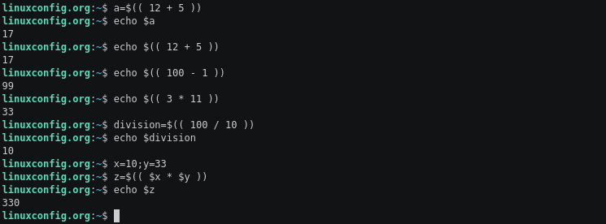

# BashBasics
Minitutorial de bash para sentar la cola y trabajar, de paso como para cualquier informático saber Bash es un must, vamos a hacerlo bien y dejar algo para que quede.

 Paso a paso basado en este tutorial : https://linuxconfig.org/bash-scripting-tutorial-for-beginners.

#### Que es bash? 
[Bash](https://en.wikipedia.org/wiki/Bash_(Unix_shell)) es un interprete de comandos. Es usado en muchos sistemas operativos, en gran parte gracias a que es el que viene por default en la mayoría de los sistemas [Linux](https://en.wikipedia.org/wiki/Linux). El nombre es un acrónimo de **B**ourne-**A**gain **S**hell haciendo referencia a que es un remake de [Bourne Shell](https://en.wikipedia.org/wiki/Bourne_shell).

#### Que es Shell?
Tranca palanca, estamos todos en bolas. Vamos juntos: 
Shell es todo lo que contiene la famosa terminal esa que venís abriendo desde algo1, es lo que te permite usar distintos comandos para interactuar con tu maquina, desde lo mas simple hasta lo mas complejo.

Vamos al ejemplo mas básico, abrí la terminal y escribí *date*, cual es la salida que te aparece?

#### Que es Scripting?
Supongamos que a vos te pagan por hacer todos los benditos días lo mismo (lo cual es mas común de lo que imaginamos) no seria una paja? .... Bueno Scripting es una forma de automatizar, es una forma de agrupar una serie de instrucciones en un archivo y ejecutarlo para tener ahi listo para usarlo siempre que sea necesario.


Exactamente Alejandro, venimos usando la Shell desde el dia uno, pasa que recién nos damos cuenta.
<br>

### Arranquemos con los Bifes
<br>

#### Definir nuestro interprete
Ojo al tejo que no todo interprete es Bash, también existen otros como [Korn Shell](https://en.wikipedia.org/wiki/KornShell), [C Shell](https://en.wikipedia.org/wiki/C_shell), etc. Por eso se define como una buena practica definir explícitamente que interprete se debe usar en nuestro script. Como hacemos esto? 

Aprendemos nuestro primer operador, **#!**  ([shebang](https://en.wikipedia.org/wiki/Shebang_(Unix))). Haciendo uso de este en nuestra primer linea del script dejaremos explicito bajo que interprete debe ejecutarse, en nuestro caso dejamos el path default a **Bash** : 
```sh

#!/bin/bash
```
#### Hagamos un Hola Mundo!
y si caemos en el cliche de los cliches, nuestro primer programa en **Bash**..

```sh

#!/bin/bash
echo "Hello World"
```
#### Variables
En Bash tenemos variables obviamente, ahora nos vamos a robar un ejemplo : 

```sh

#!/bin/bash
greeting="Welcome"
user=$(whoami)
day=$(date +%A)

echo "$greeting back $user! Today is $day, which is the best day of the entire week!"
echo "Your Bash shell version is: $BASH_VERSION. Enjoy!"
```
Las variables se declaran en el momento que les asignamos un valor.
$BASH_VERSION es una variable predefinida en el Shell que nos da específicamente ese dato.<br>
Pero que estamos haciendo en las variables user y day? Esta es una técnica llamada **sustitution** donde asignamos el output de un comando a una variable.<br>
Luego para imprimir el contenido de las mismas les ponemos el prefijo de **$** dentro de **echo**, dando a entender que nos interesa el contenido de dichas variables.<br>
Algo relevante que vale la pena nombrar es que los nombres en MAYUS se suelen dejar reservados para variables *globales* del shell.
#### Un ejemplo un poquito mas util : 
Backup del directorio home, usando la hora en segundos en el que la realizamos.
```sh

#!/bin/bash
# Esto es un comentario.
user=$(whoami)
input=/home/$user
output=/tmp/${user}_home_$(date +%Y-%m-%d_%H%M%S).tar.gz

tar -czf $output $input
echo "Backup of $input completed! Details about the output backup file:"
ls -l $output
```
Aprovechamos el ejemplo previo para introducir el concepto de comentarios, en *Bash* los comentarios se indican con el operador **#**, obviamente a excepción del previamente nombrado **shebang**.<br>
También hace uso de un nuevo recurso, los curly braces (**{}**), que en bash son utilizados para realizar [parameter expansion](https://www.gnu.org/software/bash/manual/html_node/Shell-Parameter-Expansion.html), donde en nuestro caso es necesarios ya que luego de la variable *$user* necesitamos concatenar el resto del texto sin espacios. Entonces es una forma de indicar desde donde hasta donde va el nombre de la variable.

#### Redireccionando de input, output y error.

Básicamente es lo mismo que hacemos con cualquier ejecutable, vamos a meter un refresh : 
* Con > redireccionamos stdout.
* Con 2> stderr.
* con &> tanto stdout como stderr.
* Análogamente con < redirrecionamos stdin.

#### Funciones

Obviamente en **Bash** también tenemos funciones, como en todo lenguaje estas aportan el poder de la modularizacion, con esto el poder de generar un código mas claro y evitar la repetición.
Siempre antes de usar una función esta tiene que estar correctamente definida.

como declaramos una función y luego llamamos una función : 

```sh

#!/bin/bash

function saludar {
    echo "Hola $(whoami)"
}

saludar
```
Vale aclarar que la indentacion es puramente opcional.

y la salida obtenida (En mi caso)

```sh
riedel@notebook:~/Documents/sisop/BashBasics$ bash Ejemplos/ejemplo_funcion.sh 
Hola riedel
```
Obviamente las distintas funciones pueden recibir parámetros, como hacemos esto? Bancame que lo vemos en un cachito....

#### Comparaciones

En bash se utilizan distintos operadores para comparar expresiones numéricas que los que se usan para comparar strings.


Un ejemplo de comparación podría ser : 
```sh
a=1
b=2
[ $a -lt $b ]; echo $?

```
Que hace "**$?**"? nos devuelve el valor de retorno de nuestra ultima expresión, en este caso la booleana, lo cual puede ser bastante util.<br>
De la misma manera pero utilizando los otros operadores podemos comparar strings.

#### Conditionals statements

Esto nos permite manejar el flujo del código, basados en distintas condiciones o eventos.<br>
En **Bash** podemos hacer uso de ***if***, ***then*** y ***else***.<br>
A continuación se deja un ejemplo :

```bash

#!/bin/bash

num_a=400
num_b=200

if [ $num_a -lt $num_b ]; then
    echo "$num_a is less than $num_b!"
else
    echo "$num_a is greater than $num_b!"
fi
```

#### Llegaron los parámetros paaaaaadre

Obviamente que en bash las funciones también tienen parámetros.
Las variables son accedidas mediante ***$1, $2, $3, ..., &N***. <br>
Y obviamente el programa principal puede recibir argumentos. <br>
Con el operador **$#** podemos ver la cantidad de argumentos que tenemos en nuestro ámbito, y con el operador **$\*** podemos obtener todos los argumentos juntos.

Como pasamos argumentos a una función? Para eso nos inventamos un ejemplo básico : 

```sh

#!/bin/bash

function saludar {
    echo $1
}
saludar "Hola Jorge"
```

#### Bash Loops
Obviamente también tenemos loops, tenemos 3 de este tipo de estructuras de control : **For**, **While** y **Until**.

#### For Loop
Lo vamos a usar particularmente para iterar sobre una lista, el ejemplo mas básico podría ser :

```sh

#!/bin/bash
for i in 1 2 3; do
    echo $i
done
```
Imagínense todo lo que podemos hacer con esto...


Y ahora un ejemplo practico (Re roba2)


Pero para para, que hace eso? 
bueno wc -c nos devuelve la cantidad de bytes que tiene una determinada input y mediante pipe le pasamos con echo cada texto. (WC no recibe variables, por eso usamos pipe).

#### While Loop

Este **loop** particular recibe una condición y se va a mantener ejecutando mientras esta condición sea verdadera, el bucle debe estar encerrado entre **DO** y **DONE**.<br>
Ejemplo trivial :
```sh

#!/bin/bash

counter=0
while [ $counter -lt 3 ]; do
    let counter+=1
    echo $counter
done
```
Recordamos que ***-lt*** es el operador ***menor***  para enteros.

#### Until Loop
Y por ultimo vamos a ver el **Util**, y esto con que se come? bueno, el nombre nos tendría que dar una pista ...

```bash

#!/bin/bash
  
counter=6
until [ $counter -lt 3 ]; do
    let counter-=1
    echo $counter
done
```

Nuestro bucle se ejecuta hasta que se cumpla la condición! En este ejemplo el output va a ser : 
```sh
5
4
3
2
```
Algo que vale la pena recordar es que ***$\**** es una lista con todos los parámetros que recibimos, esto es muy util para iterar.

#### Aritmética básica
Para terminar vamos a hacer un pequeño paso a paso por la aritmética que tiene Bash.
#### Arithmetic Expansion
Básicamente es la forma mas fácil de efectuar cálculos básicos. Solamente tenemos que encerrar cualquier expresión matemática dentro de doble paréntesis. (otro roba2)


#### expr command
 El comando ***expr** nos brinda una alternativa a a realizar operaciones matemáticas sin necesidad de encerrarlo en brackets o paréntesis.


Ojo con el operador *, tenemos que usar el backslash para poder meter el operador.

#### let command
uso similar a ***expr***, guarda la evaluación ingresada en una variable. ***Let*** implementa cosas nuevas como exponenciales o los operadores para incrementar o decrementar enteros.

#### bc command
A diferencia del resto nos permite trabajar con decimales, y es el mas complejo de los 3 comandos que vimos.


#### Bueno este fue un paso a paso, super robado y super básico. Pero nos dejo una idea general de como trabajar en bash.